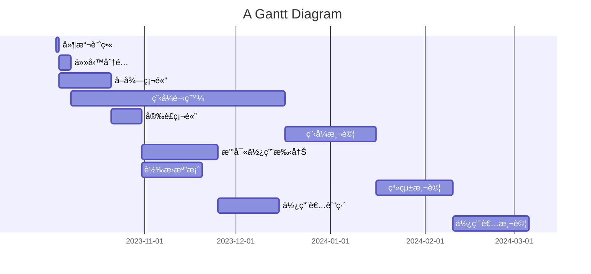
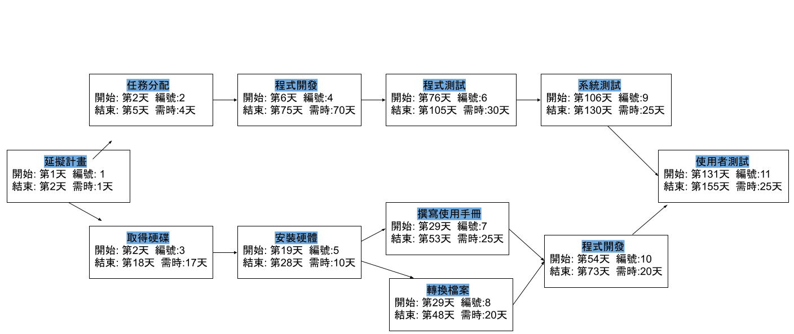

# hw2.md

# 專案管ç†
😄😄😄
# 甘特圖

```mermaid
gantt
    title A Gantt Diagram

    延擬計畫          :a1, 2023-10-03, 1d
    ä»»å‹™åˆ†é…     :a2 , after a1  , 4d
    å–得硬體   : a3 ,after a1  , 17d
    程å¼é–‹ç™¼ : a4 ,after a2  , 70d
    安è£ç¡¬é«” : a5 ,after a3  , 10d
    程å¼æ¸¬è©¦ : a6 ,after a4  , 30d
    撰寫使用手冊 : a7 ,after a5  , 25d
    轉æ›æª”案 : a8,after a5  , 20d
    系統測試 : a9,after a6  , 25d
    使用者訓練 : a10,after a7 a8  , 20d
    使用者測試 : a11,after a9 a10  , 25d

```
# PERT/CPM
 

# é—œéµè·¯å¾‘
1 -> 2 -> 4-> 6 -> 9 -> 11
